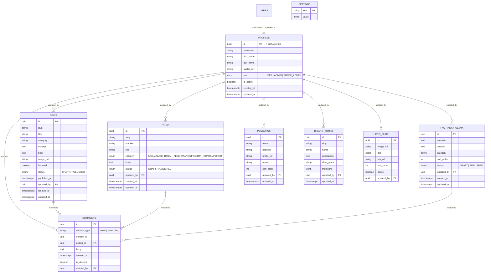

# ERD — MUI Jakarta Timur Web

Database: Supabase Postgres. Auth ditangani oleh `auth.users` (Supabase Auth); tabel `profiles` menyimpan data tambahan + role, di-link 1:1 ke `auth.users.id`.

## Diagram (ringkas)

## Catatan Desain
- **Soft delete** untuk `COMMENTS` (`is_deleted` + `deleted_by`) agar moderasi admin tetap punya audit trail, bukan hard delete.
- **`status` DRAFT/PUBLISHED** pada semua modul konten agar admin bisa menyiapkan draft sebelum tayang.
- **`updated_by`** pada setiap modul konten untuk audit "siapa mengubah terakhir".
- **`SETTINGS`** tabel key-value generik untuk: lokasi default jadwal sholat (`default_location`), kredensial integrasi IG/YouTube (terenkripsi di Supabase Vault, bukan disimpan plaintext di tabel biasa), dan flag lain.
- Row Level Security (RLS) Supabase:
  - `profiles`: user hanya bisa baca/update baris miliknya sendiri; admin/super_admin bisa baca semua.
  - Tabel konten (`news`, `fatwa`, dll): `SELECT` terbuka untuk status `PUBLISHED` (anon + authenticated), `INSERT/UPDATE/DELETE` hanya role `ADMIN`/`SUPER_ADMIN` (dicek lewat fungsi `is_admin()` yang membaca `profiles.role`).
  - `comments`: `INSERT` untuk authenticated user (harus `author_id = auth.uid()`), `DELETE` untuk pemilik komentar ATAU admin/super_admin.
- Prisma schema (`prisma/schema.prisma`) akan diperluas merefleksikan ERD ini, tapi migrasi dieksekusi lewat Supabase (SQL migration), Prisma hanya untuk type-safety query di server actions/API routes.
